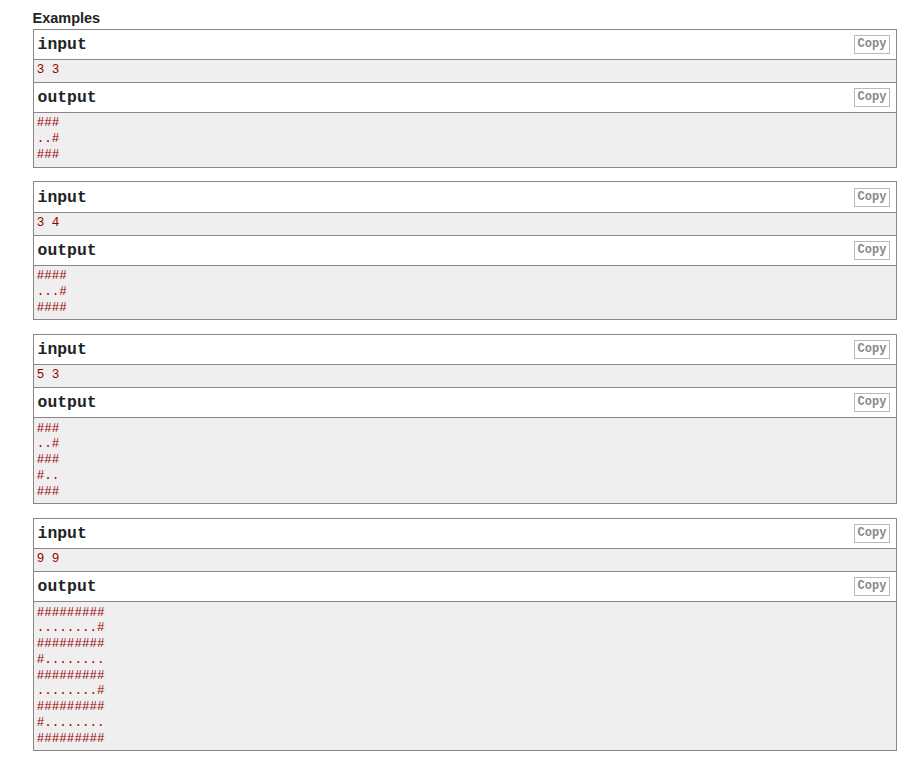

# A. Fox And Snake

**Time Limit:** 2 seconds
**Memory Limit:** 256 megabytes

Fox Ciel has just started learning programming. Her first task was to draw a fox, but that turned out to be too difficult for a beginner. So instead, she decided to draw a **snake**.

---

## Snake Description

The snake is drawn on an `n × m` grid.

* Each cell is identified as `(r, c)` where:

  * `r` = row number
  * `c` = column number

### Snake Movement Pattern

1. The snake **starts** at cell `(1, 1)` (the tail).
2. It moves **right** across the first row until `(1, m)`.
3. Then it goes **down by 2 rows** to `(3, m)`.
4. From there, it moves **left** until `(3, 1)`.
5. This pattern continues:

   * Odd rows contain the snake.
   * Even rows are mostly empty except where the snake turns.

---

## Cell Representation

* Snake cells are represented by `#`
* Empty cells are represented by `.`

---

## Input

A single line containing two integers:

```
n m
```

### Constraints

* `3 ≤ n, m ≤ 50`
* `n` is guaranteed to be an **odd number**

---

## Output

Print `n` lines.
Each line must contain exactly `m` characters (`#` or `.`).
Do **not** print spaces between characters.

